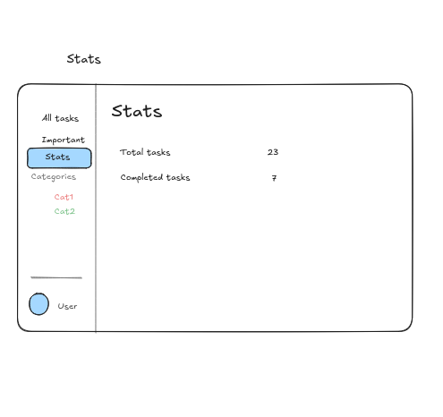

# bootcamp-project

A web application designed for task management

We can add tasks, see tasks, mark as completed the tasks, delete tasks and see our stats

## Home Page

The home page displays all your tasks in one central location. The left sidebar provides quick navigation to different views including All tasks, Important, Stats, and Categories. Each task shows its current status with visual indicators for completion. You can expand any task to see more details and manage it.

## Add Task

Adding a new task is simple and intuitive. Enter the task name in the input field, add a detailed description if needed, and select a category from the dropdown. This workflow keeps your tasks organized and helps you categorize them for better management.

## Statistics Dashboard

Track your productivity with the Statistics page. View your total number of tasks and how many you've completed. This gives you a quick overview of your progress and helps motivate you to complete more tasks.