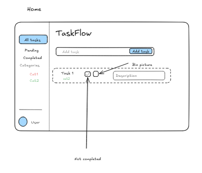
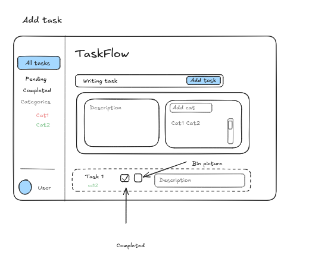
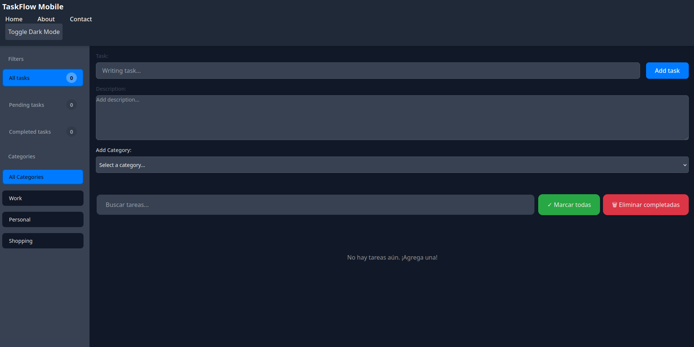
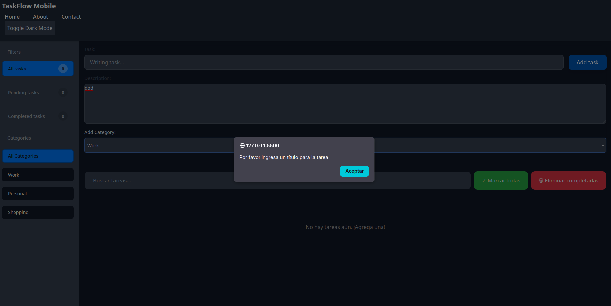
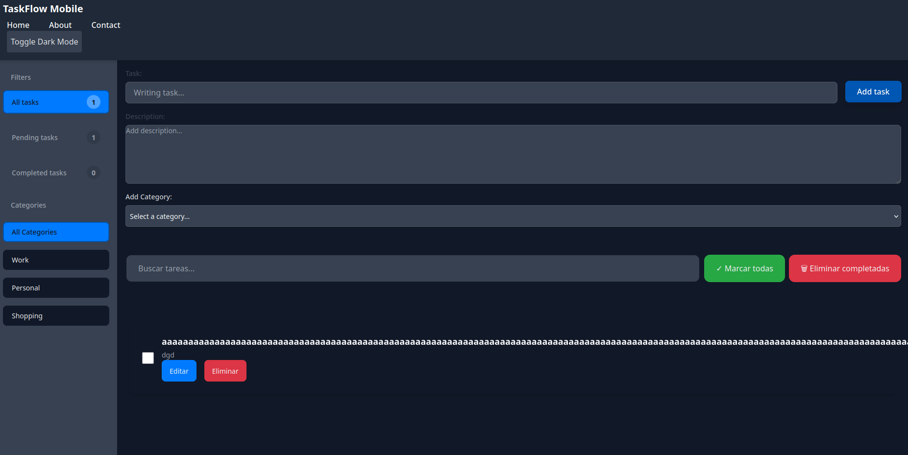
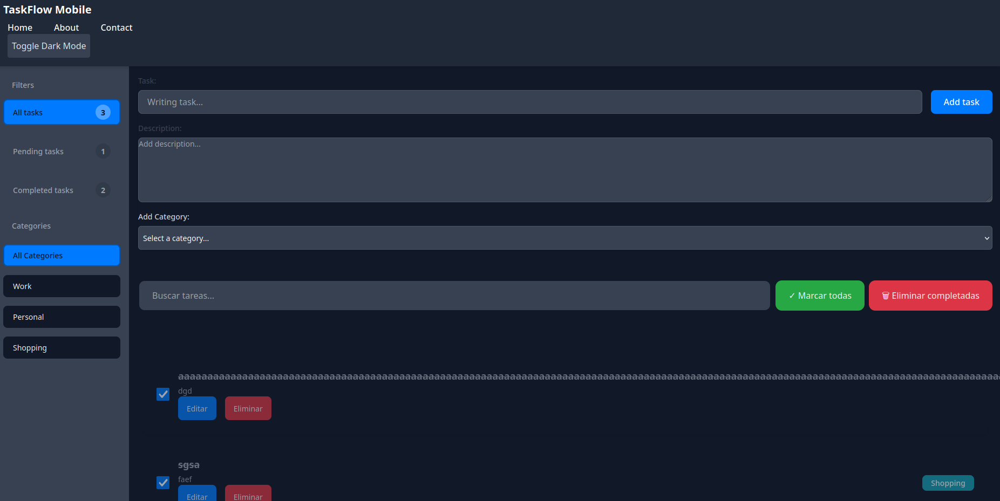
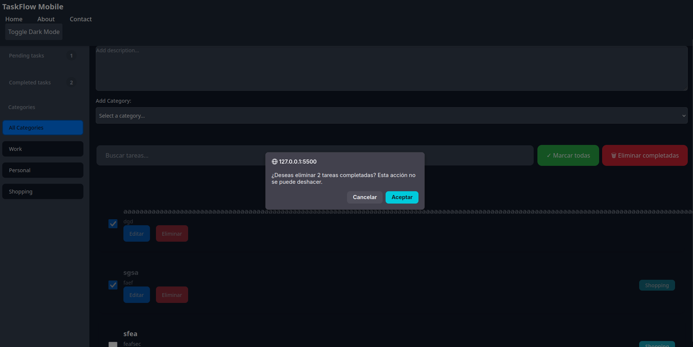
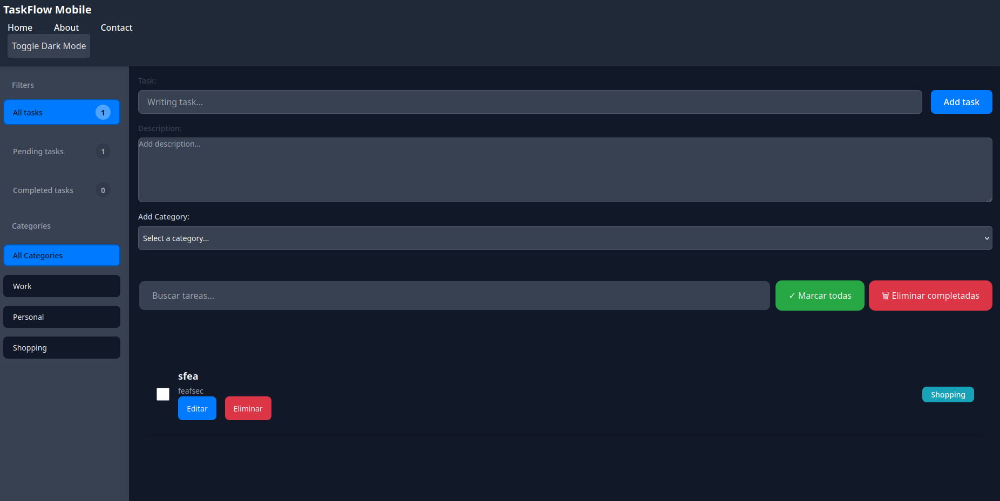

# TaskFlow

Aplicación web de gestión de tareas con arquitectura cliente-servidor.
El frontend es una SPA construida con JavaScript Vanilla que consume una API REST implementada con Node.js y Express.

Demo en producción: https://bootcamp-project-nine.vercel.app/

---

## Índice

- [Descripción](#descripción)
- [Instalación](#instalación)
- [Uso](#uso)
- [Documentación del backend](#documentación-del-backend)
- [Tecnologías principales](#tecnologías-principales)

---

## Descripción

TaskFlow es una aplicación de gestión de tareas que permite crear, editar, eliminar y organizar tareas en una interfaz sencilla.
El frontend y el backend están desacoplados, lo que facilita el desarrollo y la escalabilidad del proyecto.

## Instalación

1. Clona el repositorio.
2. En la raíz del proyecto, instala las dependencias:
   ```bash
   npm install
   ```

## Uso

1. Ejecuta el servidor backend:
   ```bash
   npm run dev
   ```
2. Abre el frontend en tu navegador o ejecuta el servidor de desarrollo correspondiente si está separado.

## Documentación del backend

Todos los detalles técnicos del backend, incluyendo rutas, configuración y comandos, están en:

- `docs/backend-api.md`

## Tecnologías principales

- Node.js
- Express
- JavaScript Vanilla
- API REST
# TaskFlow

Aplicación web de gestión de tareas con arquitectura cliente-servidor. El frontend es una SPA (_Single-Page Application_) construida con JavaScript Vanilla que consume una API REST propia implementada con Node.js y Express.

Demo en producción: https://bootcamp-project-nine.vercel.app/

---

## Índice


1. [Ejecución local](#1-ejecución-local)
2. [Despliegue del backend en Vercel](#2-despliegue-del-backend-en-vercel)
3. [Capturas de pantalla](#3-capturas-de-pantalla)

---


## 1. Ejecución local

### Requisitos

- Node.js ≥ 18
- Un servidor de archivos estáticos (ej. [Live Server](https://marketplace.visualstudio.com/items?itemName=ritwickdey.LiveServer) para VS Code, o `npx serve`)

### Pasos

```bash
# 1. Clonar el repositorio
git clone <url-del-repo>
cd bootcamp-project

# 2. Instalar dependencias del servidor
cd server
npm install

# 3. Arrancar el servidor de desarrollo (con recarga automática via nodemon)
npm run dev
# → Servidor disponible en http://localhost:3000

# 4. En otra terminal, servir el frontend desde la raíz del proyecto
cd ..
npx serve .
# → Frontend disponible en un puerto distinto al del servidor (por ejemplo http://localhost:3001)
```

### Variables de entorno

El servidor carga variables desde un archivo `.env` en `server/`. El único campo soportado actualmente es:

```
PORT=3000
```

Si no existe `.env`, el puerto por defecto es `3000`.

### Cambiar la URL base de la API

Para apuntar el frontend a un servidor en otro puerto o dominio, define la variable global antes de cargar `app.js`:

```html
<script>
  window.TASKFLOW_API_BASE_URL = "https://api.example.com/api/v1";
</script>
<script type="module" src="app.js"></script>
```

---

## 2. Despliegue del backend en Vercel

Configuración para **un único proyecto Vercel** (frontend + API en el mismo dominio), sin `package.json` en raíz:

- `vercel.json` (en la raíz) enruta `/api/*` hacia `server/src/index.js` y sirve los archivos estáticos del frontend.
- `server/src/index.js` evita `app.listen(...)` cuando detecta entorno Vercel (`process.env.VERCEL === "1"`).
- Las dependencias del backend permanecen en `server/package.json`.

### Pasos recomendados (alternativa 2)

1. Crea un proyecto nuevo en Vercel importando este repositorio.
2. Mantén **Root Directory** en la raíz del repo (no en `server`).
3. En Build & Development Settings configura:
  - Install Command: `cd server && npm install`
  - Build Command: vacío (no se requiere build)
  - Output Directory: vacío
4. Despliega de nuevo.
5. Verifica el health check en:
  - `https://<tu-proyecto>.vercel.app/api/v1/health`

Si `/api/v1/health` devuelve 200, el backend ya está activo en el mismo dominio del frontend.

### Conectar el frontend al backend desplegado

Antes de cargar `app.js`, define la URL base de la API en `index.html`:

```html
<script>
  window.TASKFLOW_API_BASE_URL = "https://<tu-proyecto-backend>.vercel.app/api/v1";
</script>
<script type="module" src="app.js"></script>
```

---

## 3. Capturas de pantalla

Página principal:


Formulario de alta de tarea:


Lista vacía:


Validación de título vacío:


Títulos largos:


Múltiples tareas completadas:


Confirmación y resultado de borrado múltiple:



## Funcionalidades Detalladas

### Gestión de tareas
- Alta de tarea con validación.
- Edición mediante diálogo modal.
- Eliminación individual.
- Marcado de completado individual.

### Acciones masivas
- Marcar/desmarcar todas las tareas visibles.
	- Respeta filtros activos: estado, categoría y búsqueda.
- Eliminar todas las tareas completadas con confirmación estilizada.

### Filtros y búsqueda
- Filtro por estado: todas, pendientes, completadas.
- Filtro por categoría desde sidebar.
- Búsqueda por título, descripción o categoría.
- Mensajes de feedback en búsqueda y botón para limpiar texto.
- Resaltado visual de coincidencias.

### Categorías
- Campo de categoría libre con datalist.
- Creación de categorías nuevas al escribir y presionar Enter.
- Selector rápido de categorías (quick picker) en alta y edición.
- Categorías derivadas de las tareas cargadas desde la API.

### Ordenación
- Orden por creación o alfabético.
- Dirección ascendente o descendente.

### Tema y UX
- Modo oscuro con preferencia inicial del sistema.
- Diálogo Acerca de en footer.
- Confirmación personalizada para acciones críticas.

## Ejemplos de Uso

### Ejemplo 1: Crear y organizar una tarea
1. Escribe en Tarea: "Estudiar JavaScript".
2. En Descripción añade: "Repasar funciones y arrays".
3. En Añadir categoría escribe "Bootcamp" y pulsa Enter para crearla.
4. Pulsa Añadir tarea.
Resultado esperado: la tarea aparece en la lista y la categoría Bootcamp queda disponible para futuras tareas.

### Ejemplo 2: Filtrar por categoría y completar solo lo visible
1. Haz clic en la categoría "Bootcamp" en la barra lateral.
2. Pulsa "Marcar todas como completadas".
3. Confirma en el diálogo estilizado.
Resultado esperado: solo cambian de estado las tareas visibles de la categoría seleccionada.

### Ejemplo 3: Buscar una tarea y ver coincidencias resaltadas
1. Escribe "javascript" en el buscador.
2. Observa el contador de resultados y el resaltado en título, descripción y categoría.
3. Pulsa el botón X del buscador para limpiar la búsqueda.
Resultado esperado: la lista se filtra en tiempo real y vuelve al estado normal al limpiar.

### Ejemplo 4: Ordenar tareas
1. Pulsa "Orden: creación" para alternar a "Orden: A-Z".
2. Pulsa "Dirección: Asc" para cambiar a descendente.
Resultado esperado: el listado se reordena sin perder filtros activos.

### Ejemplo 5: Editar y registrar fecha de modificación
1. Pulsa "Editar" en una tarea existente.
2. Cambia el título o descripción y guarda.
Resultado esperado: en la tarjeta aparece "Editada: DD/MM/AAAA" junto a la fecha de creación.

### Ejemplo 6: Eliminar tareas completadas con confirmación
1. Marca algunas tareas como completadas.
2. Pulsa "Eliminar completadas".
3. Confirma en el diálogo.
Resultado esperado: se eliminan las completadas y se actualizan contadores y lista.

## Documentación de Funciones (app.js)

### 1) Utilidades generales

- getElement(id): obtiene un elemento del DOM por id.
- refreshUI(): refresca contadores, categorías, datalist y lista.
- persistAndRefresh(): sincroniza categorías en memoria y refresca UI.
- addListenerIfExists(elementId, eventName, handler): añade listeners de forma segura.

### 2) Comunicación con API

- loadTasks(): carga tareas desde la API y normaliza el estado inicial.
- initializeDefaultState(): reinicia estado en memoria.
- clearAllData(): elimina tareas remotas y reinicia aplicación.
- src/api/client.js: concentra `getTasks`, `createTask`, `updateTask` y `deleteTask`.

### 3) Creación y validación de tareas

- formatTaskDate(dateValue): normaliza una fecha a formato es-ES.
- buildTaskMetaText(task): compone texto Creada/Editada mostrado en tarjeta.
- validateTaskForm(title, description, tag): valida campos y devuelve datos normalizados.
- addTask(title, description, tag): crea una tarea vía API, actualiza estado y re-renderiza.
- clearForm(): limpia formulario de alta.

### 4) Categorías

- addCategoryIfNew(tag): añade categoría si no existe (comparación case-insensitive).
- createCategoryChip(category, input, quickPicker): crea botón rápido de categoría.
- renderCategoryQuickPicker(input, quickPicker): pinta sugerencias filtradas.
- setupCategoryQuickPicker(inputId, quickPickerId): conecta eventos de quick picker.
- updateCategoriesDatalist(): sincroniza opciones del datalist.
- renderSidebarCategories(): renderiza categorías de la barra lateral.
- filterByCategory(category): aplica categoría activa y actualiza estado visual.

### 5) Estado de tareas y edición

- updateCounters(): actualiza contadores de todas/pendientes/completadas.
- deleteTask(task): elimina una tarea individual vía API.
- toggleTaskCompletion(task): alterna estado de completado vía API.
- openEditTaskDialog(task): abre modal de edición con datos precargados.
- submitEditTaskForm(): valida y guarda cambios de edición vía API.
- closeEditTaskDialog(): cierra modal de edición y limpia referencia activa.

### 6) Confirmaciones y acciones masivas

- showStyledConfirm(message): muestra diálogo de confirmación custom y devuelve Promise<boolean>.
- markAllTasksComplete(): marca o desmarca tareas visibles según filtros activos.
- deleteAllCompletedTasks(): elimina todas las tareas completadas tras confirmación.

### 7) Filtros, búsqueda y orden

- getFilteredTasks(): aplica filtros por estado, categoría y búsqueda.
- updateActiveFilter(filterId): marca visualmente el filtro activo.
- setFilter(filter): cambia filtro de estado y re-renderiza.
- updateSearch(term): actualiza término de búsqueda y re-renderiza.
- updateSearchFeedback(resultCount): muestra mensajes y estado del input de búsqueda.
- clearSearch(): limpia búsqueda activa y devuelve el foco al input.
- getTaskCreationTimestamp(task): obtiene timestamp robusto de creación.
- sortTasksByMode(taskList): ordena por modo y dirección seleccionados.
- updateSortButtonLabels(): sincroniza texto de botones de orden.
- toggleSortMode(): alterna entre orden por creación y alfabético.
- toggleSortDirection(): alterna ascendente/descendente.

### 8) Renderizado de tareas

- getEmptyMessage(): devuelve mensaje contextual cuando no hay resultados.
- escapeRegExp(value): escapa texto para usarlo en expresiones regulares.
- renderHighlightedText(element, text, term): renderiza texto con resaltado de búsqueda.
- fillTaskData(taskElement, task): inyecta título, descripción, meta y categoría.
- createTaskActionButton(label, className, onClick): genera botones de acción.
- addTaskEvents(listItem, task): conecta eventos (checkbox) por tarea.
- renderTaskItem(task): construye un item de lista desde template.
- renderTasks(): renderiza la lista final aplicando filtros y orden.

### 9) Inicialización y tema

- setupFilterButtons(): conecta botones de filtro principal.
- initializeDarkMode(): aplica la preferencia del sistema al arrancar.
- updateDarkModeButtonLabel(isDark): actualiza texto del botón de tema.

Eventos principales:

- DOMContentLoaded: carga datos, configura listeners y prepara la interfaz.
- Clic en Acerca de: abre diálogo informativo del proyecto.
- Clic en botón de modo oscuro: alterna tema durante la sesión actual.

No hay persistencia en el navegador. El estado depende de la API en ejecución y del almacenamiento en memoria del servidor.
